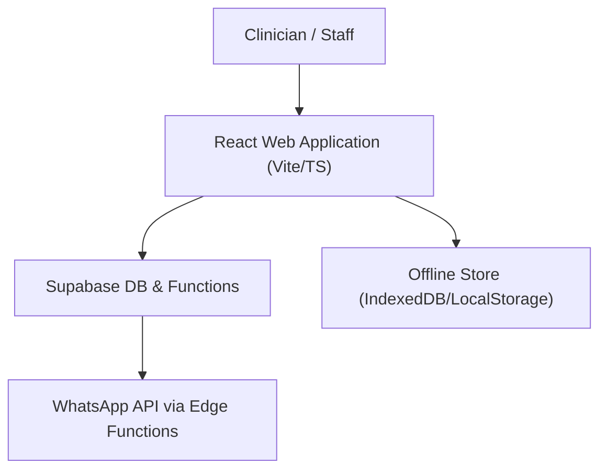
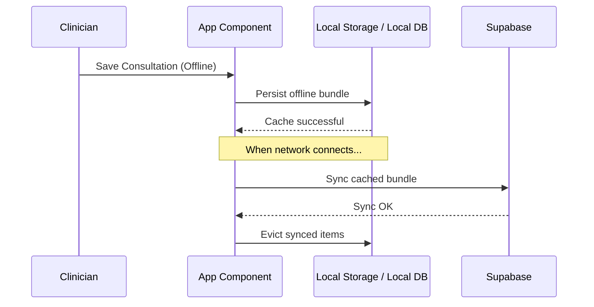

# OrthoLife Architecture Documentation

Welcome to the OrthoLife Technical Architecture document. This document maps out the current system architecture, state management patterns, and implementation strategies used throughout the platform.

---

## 1. System Overview

OrthoLife is a high-performance clinical workspace designed for orthopedic outpatient and inpatient management. It integrates a complete digital record system with scheduling, smart PDF document generation, multi-branch print overrides, and reliable offline data synchronization.

---

## 2. Core Modules

### 2.1 Outpatient Consultation (`/op`)
The outpatient workflow is the core engine for day-to-day consultations.
- **Main Entry Point**: `src/pages/Consultation.tsx`
- **Sub-components**: `ConsultationSidebar`, `PatientDemographics`, `VitalsForm`, `ClinicalNotesForm`, `MedicationManager`, `FollowUpSection`.
- **Advanced Features**:
  - **Auto-save & Dirty Checking**: Guards against navigating away with unsaved inputs. Decouples location overrides from global dirty states.
  - **Dynamic Patient Timeline**: Reusable timeline selector to browse historical consultations, operative notes, and discharge summaries seamlessly.
  - **On-the-fly Autofill**: Automatically fetches patient history and prefills previous medications or findings when a new consultation is created.

### 2.2 InPatient Management (`/ip`)
Manages admissions, treatment tracking, and discharge summaries for admitted cases.
- **Main Entry Point**: `src/pages/InPatientManagement.tsx`
- **Core Functionality**:
  - Admission registration, procedure scheduling, room allocations.
  - **Dynamic Discharge Summaries**: Tracks clinical course details, medications, and advice.
  - **Consent Management**: Integration with public digital signatures and selfies stored securely via Supabase bucket.

### 2.3 Engagement Hub & WhatsApp (`/wa`, `/whatsapp`)
- Provides direct messaging and scheduled communication for both outpatient and inpatient workflows.
- Uses `scheduleService` to create scheduled tasks executed via background triggers.
- Leverages Supabase edge functions to perform reliable, internationalized WhatsApp message notifications and media transfers.

### 2.4 Pharmacy & Diagnostics (`/pharmacy`, `/diagnostics`)
- Modular routes for tracking medication inventory, pharmacy orders, supplier management, and local lab testing results.

---

## 3. Data Flow and State Management

### 3.1 Local vs Server State
- **Server State**: Managed via TanStack Query (`@tanstack/react-query`) for highly cached, optimistic data fetches and mutations.
- **Local State**: Component level `useState` or `useMemo` combined with local storage syncing (for location preferences, GPS status, and language choices).

### 3.2 Offline Sync Architecture

- When the application detects offline status using `useOnlineStatus`, mutations are queued into the `offlineStore`.
- On reconnection, `GlobalSyncManager` fires, resolving queued operations chronologically.

---

## 4. Advanced Printing System

OrthoLife features pixel-perfect printing for **Prescriptions**, **Medical Certificates**, **Receipts**, and **Discharge Summaries** using `react-to-print`.

### 4.1 Cross-Location Synchronization
- Individual branches (locations) have distinct **letterheads, fonts, profile configurations, and branding**.
- Settings are resolved location-by-location out of the consultant's `messaging_settings`.
- Locations are normalized via string comparison rules (`areLocationsEqual`) to eliminate mismatches before fetching overrides.

### 4.2 Page and Space Geometry
- First-page and multi-page layouts enforce standardized relative containers (`210mm` width).
- Print spacers avoid cutting off signatures or overlapping with existing letterhead branding.

---

## 5. Development Guidelines

- **TypeScript Type Safety**: All types must strictly align with schema definitions found in `src/types/`. Avoid manual ad-hoc casts.
- **Pure Functions**: Keep UI layout and clinical computational logic separated (`src/lib/utils.ts`, `src/lib/consultation-utils.ts`).
- **Comments and JSDocs**: Keep all JSDoc blocks updated with latest types and fallback paths.
